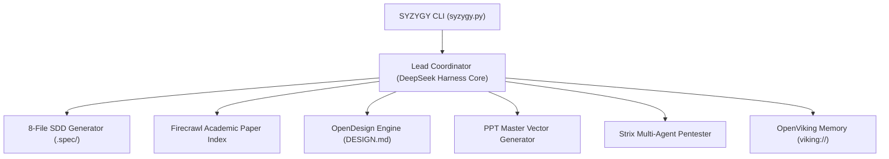

# System Architecture (Architecture.md)
## Project SYZYGY: Multi-Agent Topology & Inter-Process Communication

---

### 1. Multi-Agent Mesh Topology
SYZYGY implements Antonio Gulli's **Lead Coordinator with Dynamic Model Routing and Parallel Subagents** (Chapters 2, 3, 4, 7):

---

### 2. Core Architectural Components

1. **Lead Coordinator (`core/orchestrator.py`):**
   - Ingests the project scope and selects the optimal subagents based on the domain.
   - Maintains execution state and dispatches sub-tasks sequentially or in parallel.
2. **Context Database (`core/memory.py`):**
   - Interacts with OpenViking using `viking://` URIs:
     - `viking://session/active`: Current prompt and task graph.
     - `viking://memory/agent`: Cross-session learned developer patterns.
     - `viking://knowledge/domain`: Verified papers and architectural blueprints.
3. **Spec-Driven Generator (`syzygy.py init`):**
   - Enforces the creation of the 8 specification files before code generation starts.
4. **Vector Presentation Engine (`core/presenter.py`):**
   - Synthesizes editable `.pptx` presentations mapped to the 10-slide SIH Grand Finale standard.
5. **Security Gate (`core/pentest.py`):**
   - Runs Strix pre-flight security scans and verifies zero credential exposure.
